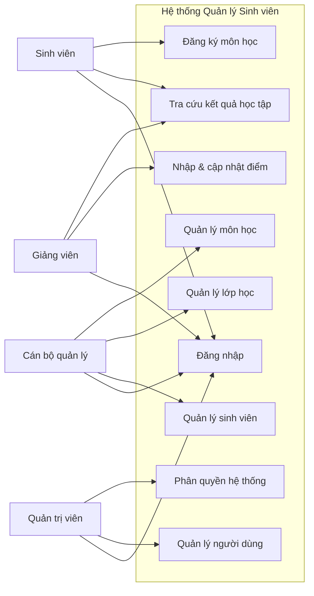

```mermaid
flowchart LR
    SV[Sinh viên]
    GV[Giảng viên]
    CB[Cán bộ quản lý]
    QT[Quản trị viên]

    subgraph HT[Hệ thống Quản lý Sinh viên]
        Login[Đăng nhập]
        TraCuuDiem[Tra cứu kết quả học tập]
        DangKyMH[Đăng ký môn học]

        QLSV[Quản lý sinh viên]
        QLLop[Quản lý lớp học]
        QLMH[Quản lý môn học]
        NhapDiem[Nhập & cập nhật điểm]

        QLUser[Quản lý người dùng]
        PhanQuyen[Phân quyền hệ thống]
    end

    SV --> Login
    SV --> TraCuuDiem
    SV --> DangKyMH

    GV --> Login
    GV --> NhapDiem
    GV --> TraCuuDiem

    CB --> Login
    CB --> QLSV
    CB --> QLLop
    CB --> QLMH

    QT --> Login
    QT --> QLUser
    QT --> PhanQuyen
```
